# Project Four - Extreme Meet Up

Software Engineering Immersive: Project 4 (Solo Project)

This was a solo project for the Software Engineering Immersive at General Assembly London (Week 12), built with React.js and Django.

## Built With

1. HTML5
2. Styling
   - CSS3
   - Bulma
3. JavaScript
   - ECMAScript6
   - React.js
   - Node.js
   - Express.js
   - Axios
4. PostgreSQL
   - Django
5. Testing
   - Manual: Insomnia
6. GitHub

# User Experience

## Login & Register

User registration and login is required if the user wishes to perform create, update and delete functions on the database. Read capabilities are accessible without registration, however due to the setup of some sections of the site, a user may not be able to read data on come pages, as the code will return null if there is no user present. This is a bug I need to look into fixing, as I would like to enable the user to access sections of the site without registration.

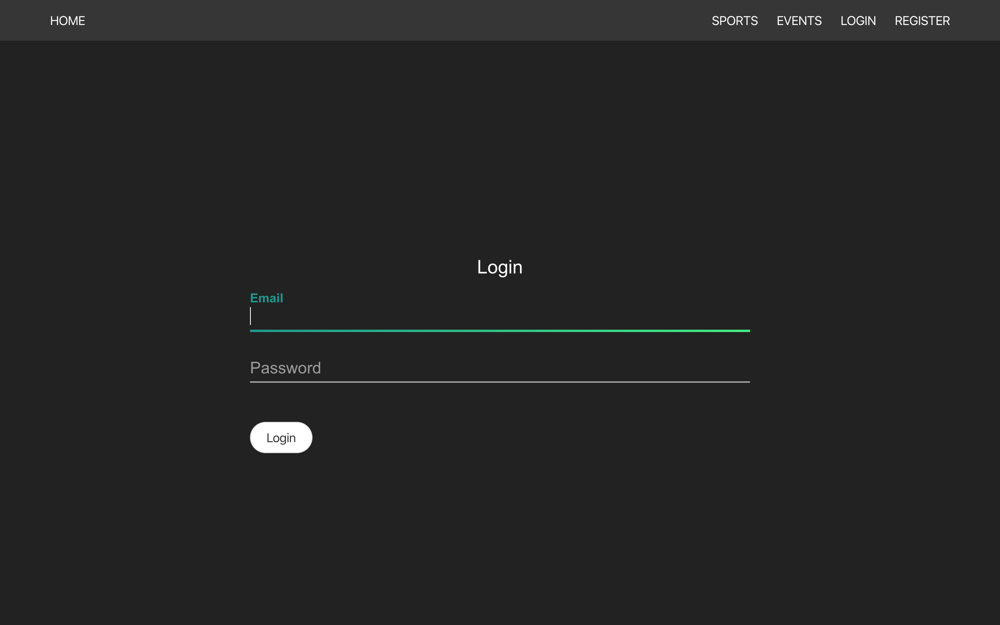

#

## Profile

Once logged in, users can navigate to the 'MY ACCOUNT' section (accessible from the navigation bar) if they wish to edit any section of their account, such as updating their name, password or profile image.

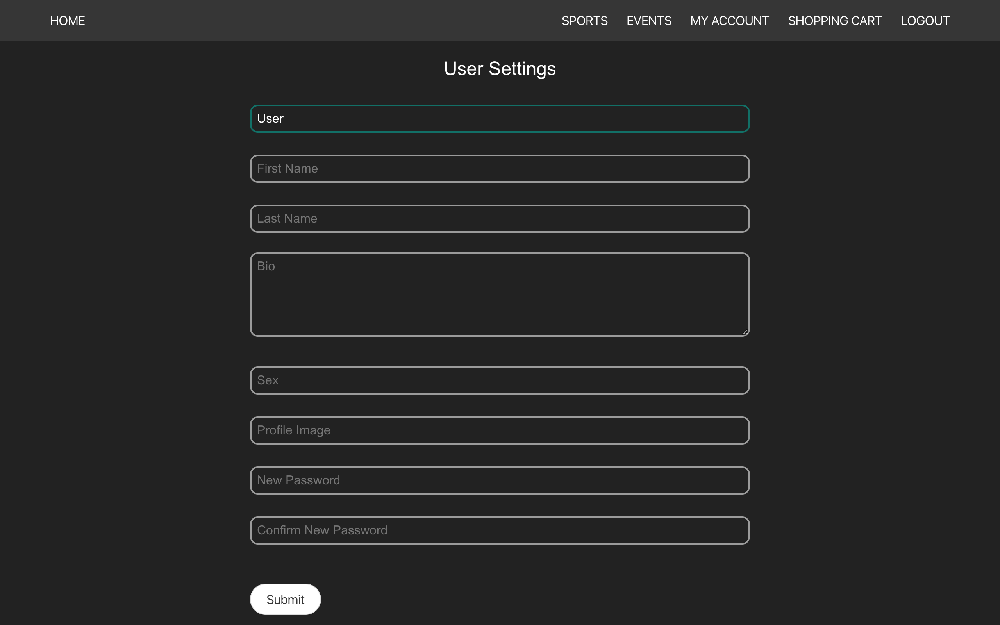

The user can view their own profile or any other user's profile by entering the user ID in the URL, or by clicking on a user's card in the `event_group` section of the `event_display` page. If the user ID of the currently logged in user matches the profile ID, then the user will be shown an 'Edit' button, clicking which will navigate the user to the `user_form`.

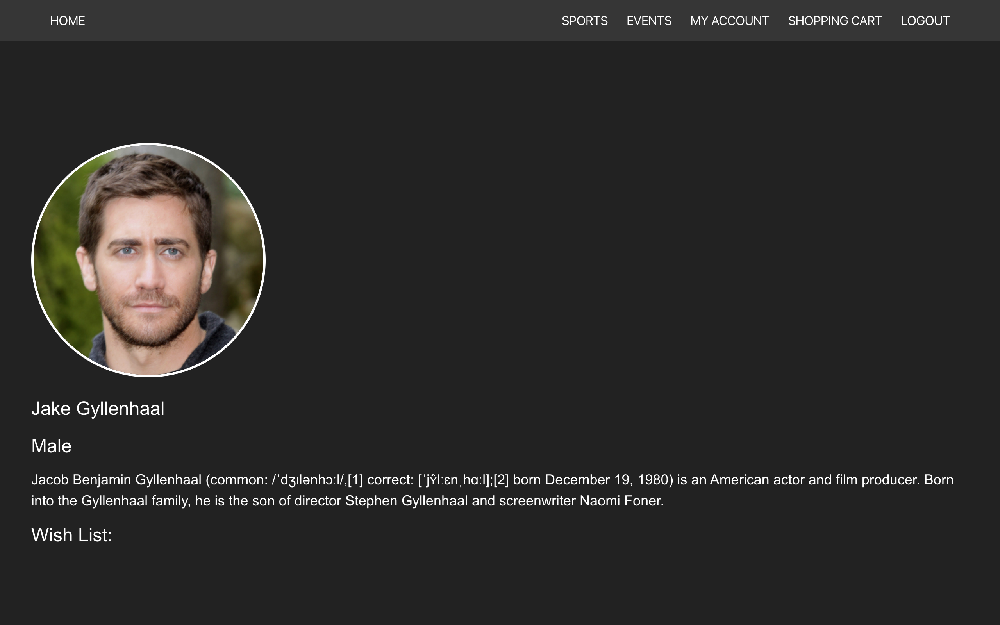

#

## Homepage

The homepage is the page any user is presented with upon navigation to the URL. This displays the site name, slogan and an image. Users can navigate to other sections of the app from here using the links in the navigation bar.

#

## Posting/editing/deleting a sport

Active users (logged in) can post to the sport section of the database by navigating to the 'SPORTS' link in the navbar and selecting 'Create Sport'.

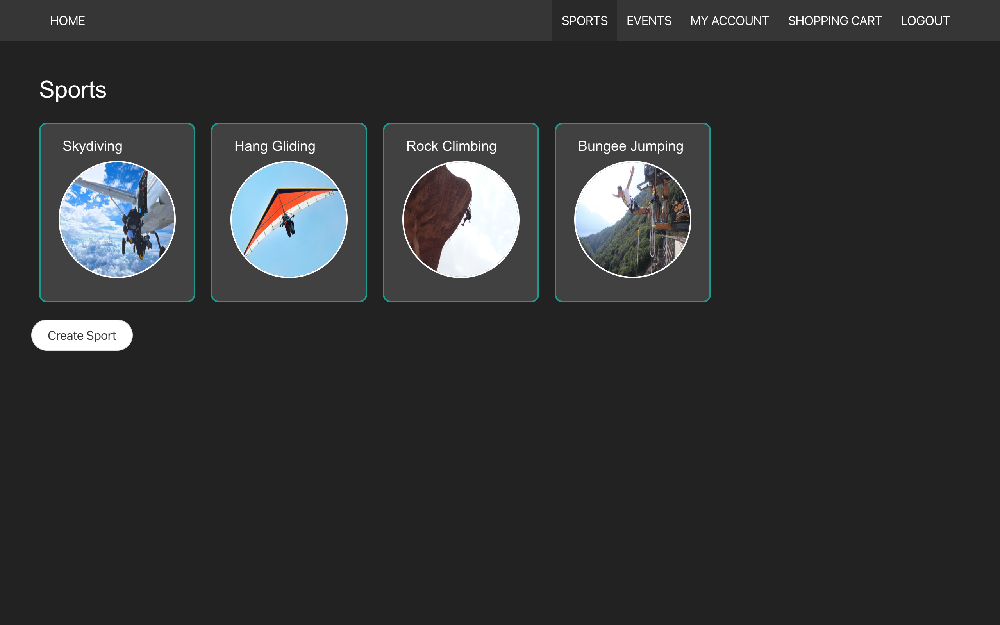

Users will then be presented with a form for completion.

If a user selects a sport from the sport index page, they will then be shown the sport in detail. This page displays all the sport information, including a brief summary, event's linked to said sport, and a graphic that represents the sport.

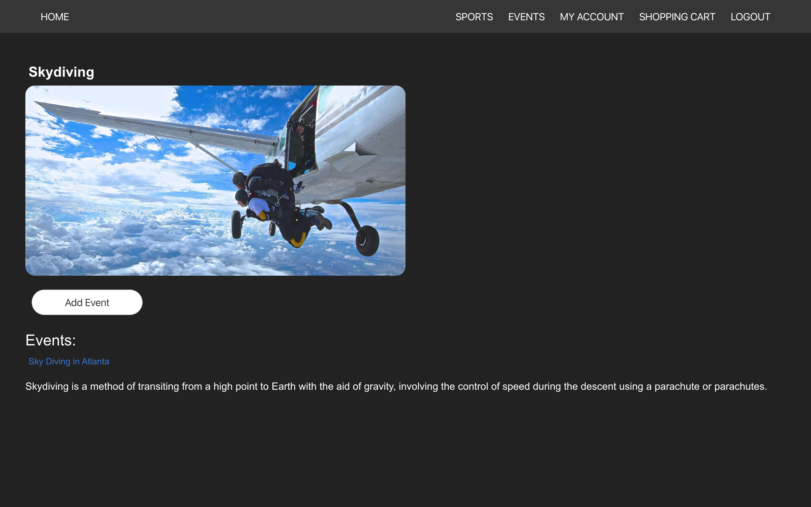

If the user created the sport in question, then 'Edit Sport' and 'Delete Sport; buttons will appear, enabling the user to respectively amend any details of the sport or delete it entirely. If the user selects the edit function, then the form displayed above will be automatically populated with the pre-existing data.

#

## Posting/editing/deleting an event

Again, users must be logged in to perform CUD actions on the event section of the database (read actions do not require a user to be logged in here). This can be achieved by logging in, navigating to the 'EVENTS' section of the site and selecting 'Create Event'.

A form is then displayed for the user to complete.

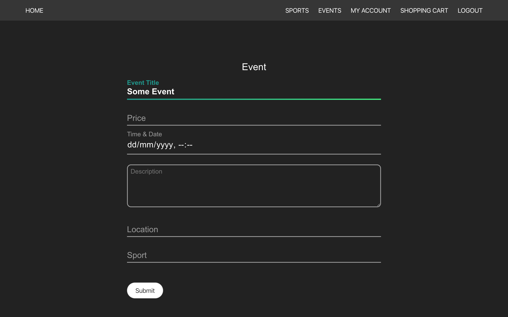

The same as with the sport section, when an event is selected from the event index page, the user will be shown the event display page, which contains information in detail relating to a single event. This data includes, location, price, date, title and teams. IF the user logged in is the owner of the event, then they too can edit and delete the event by selecting the appropriate buttons that will appear if the conditions for ownership are met.

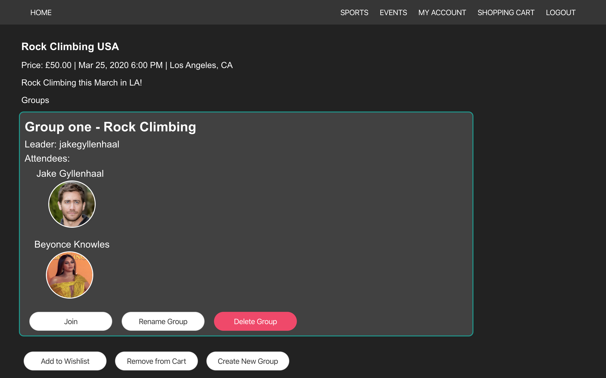

The user can also add and remove the event from their wish list and shopping cart by selecting the appropriate buttons displayed in the above screenshot. Note that the user can also add themselves to any teams nested within the event, create new teams, and if they own the team, edit the team name and delete the team altogether.

#

## Shopping Cart and Checkout

The user has a shopping cart that is attached to their account ID. This is a list of dictionaries that is edited whenever the user performs an update on this section of the database. The user's shopping cart can be viewed by navigating to the 'SHOPPING CART' link in the navbar.

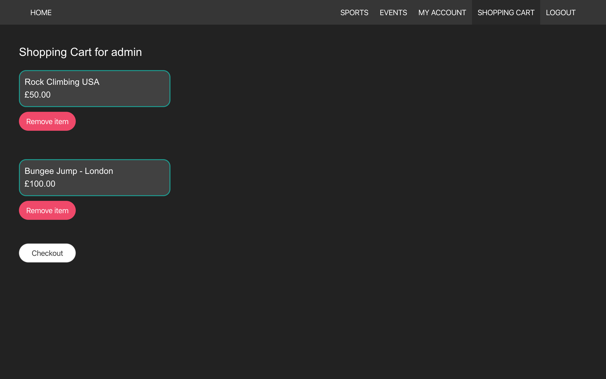

The shopping cart will display all items in the cart and will also allow the user to remove any items they do not want before checkout. Each card within the checkout also links to the appropriate event display page.

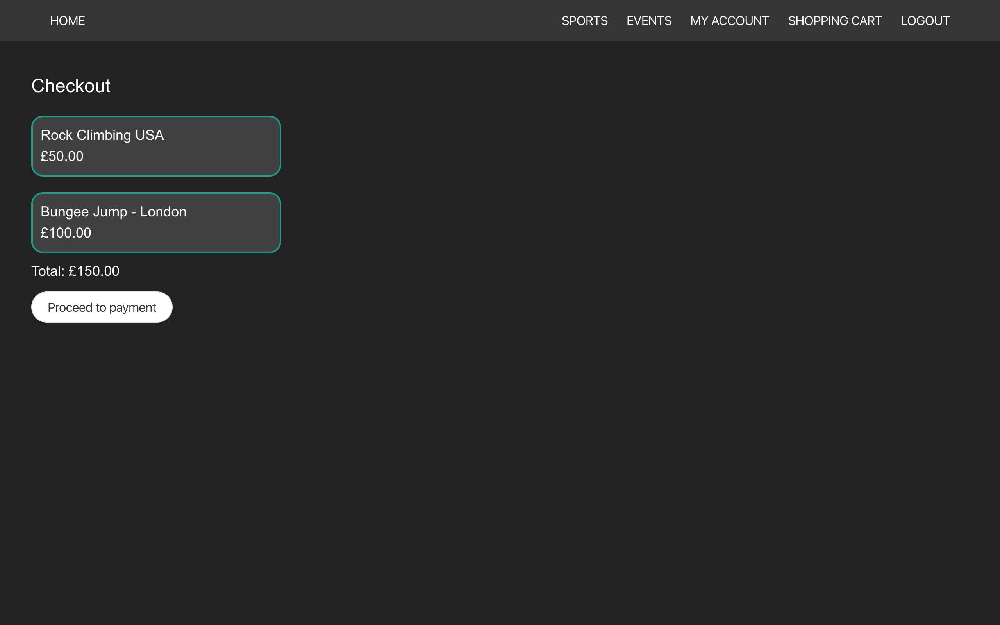

The checkout screen displays all items and the grand total. This page is for the user's information solely. They cannot remove any items from the checkout.

The payment screen uses `react-credit-cards` and an animated graphic I found online that displays the user's inputted data (i.e. the card number, their name, the expiration date and the CVC). The card graphic at the top will automatically change depending on the first series of digits that are entered, as this will dictate the card type (e.g. AMEX, MasterCard, VISA...). The graphic will also flip over to show the reverse of the card when the user clicks on the CVC field of the form.

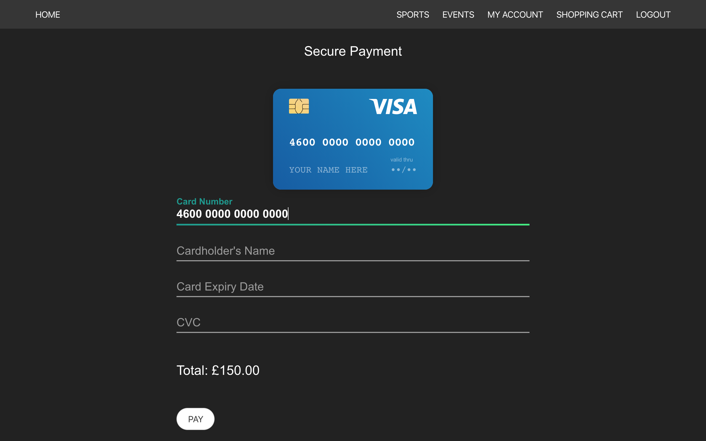
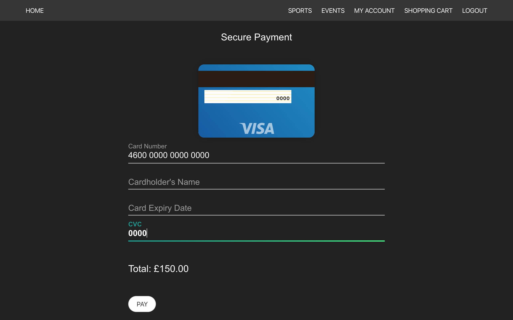

This section of the site is for display purposes only at current, to show what I would like to happen on the app; no payment will be taken in the case of a user entering correct card details, and none will be saved.

#

## Planning

-- BACKEND --

The backend of this app was created over the course of two days and was edited as capabilities and errors were discovered. I used Django to develop the backend for this project.

The ERD above demonstrates the different sections of the database and how they relate to each other. Many of the same user capabilities I developed with my team on project three were implemented on this project. For example, the capability to add and remove yourself from a team, create new teams, add events etc. I worked on and resolved the issues I faced from project three in project four, hence all actions that are possible in the frontend are functional in the backend. The project three database does not have all of the user capabilities or sections that this database has, for example the shopping cart or payment sections, which I was happy to have been able to develop in project four.

-- FRONTEND --

I used React.js to develop the frontend of the project. Axios is used to send requests to the backend and perform CRUD tasks within the database.

The frontend is located in the directory named 'frontend', which sits in the root of the project. Within 'src' there is a sub-directory named 'components' where the React.js files live. Within each of these directories you can find which components offer different request types to perform CRUD requests on different sections of the database.

## Project Management

This project took a total of seven days to complete. The week was divided as follows:

Day 1:

- Planning and creation of GitHub repository

Day 2:

- Began backend development
- Created database entries through Django admin

Day 3:

- Continual changes to backend as issues were discovered
- Start of frontend development

Day 4 - 5:

- Fixing errors as they became evident in the backend
- Continued development of frontend

Day 6:

- Begin styling
- Continued development of frontend

Day 7:

- Finished styling
- Finished development

## Successes and key learnings

I chose to challenge myself with project four by doing it individually. This was challenging in many ways, as I had the same amount of time to complete this project as I did with project three, only this time I was independently creating a frontend and backend using a new language (Python).

The main success here was that I proved to myself I was capable of producing a full-stack application by myself and with some help from my tutors. I had to learn a lot of content at a fast pace in order to produce an application that I believed delivered a more than satisfactory end result. I really got to grips with the syntax and structure of python and thoroughly enjoyed using it to develop the backend.

Additionally, I also gained skills relating to the presentation of the application (using CSS) and some skills relating to user experience. I was also able to expand on my organisation skills, problem-solving abilities, time management skills and prioritisation skills.

## Challenges & future improvements

For the week that I had, this project was challenging in many ways. My time management skills were greatly improved; because I was completing this project independently, I had to allocate enough time for each task. I believe I achieved this well, as I managed to complete all the sections that I wanted to within the allotted space of time.

Upon completion, I had successfully resolved most bugs within my code and had styled the site to a good degree. I am particularly happy that I was able to add the form styling method to the code, so that the text upon the entrance of a form field floats to the top of the input section, and the line underneath changes colour. I was also happy that I was able to incorporate a shopping cart and pseudo-payment function in the app, as this was an area of the site that was inspired from a classmate later on during the project and one that had to be developed in a timely manner.

There are several areas of the code that I would ideally like to improve and address:

- The first of these is the payment section; ideally if the site was live then payments would be possible, however as this is a mock-payment section, I am not looking to successfully take payments, but simply demonstrate that this is achievable. At current, the payment section displays a 'PAY' button, which upon activation should ideally process a user's payment and display a success of failure message. Time constraints meant that this button remains inactive, however I would have ideally allowed for a pseudo-success and -failure page to display when this button is pressed.

- Another section for development is the comments capability for events. I wanted to include this section as a possibility for users to post comments. However again, I felt that this was not of as great importance compared to other sections of the app that I wanted to develop and hence was left out of the end product. The database is set up to enable comments, however.

- At current, the database displays all groups belonging to all events when a `GET` request is sent to the `event_groups` section of the database. This is not ideal, as the request should only return groups that are unique to the specified event. In order to fix this is a timely manner, I added a filter method in the `event_display` page, as each event group also contains an event ID.

- Currently, if a user is not logged in, the `event_display` page will not load, as there is an `if` statement telling the page to render `null` if the user is not logged in. I added this conditional so that the correct buttons could display if the user is the owner of an event, hence the user could delete and edit the event as they wish. Removing this conditional statement breaks the code, so I would have to look into an effective way of rendering the buttons appropriately without breaking the code.

- I wanted to add an image upload feature for the user and for sports, however again this was something that I felt was not of such great importance compared to other sections of the app when I was developing it, as the user can still add an image using the direct URL. To achieve this, I would have used Cloudinary and allowed the user to browse for an image in their local directory, appending it to the sport as requested.

- I would ideally have liked to add a map for the event locations. At current, just the event location is shown as the creator has input it through the event form.

- When a CRUD request is sent to the backend and fails, there is no error handler that displays a message to the user (for example, if the user enters an incorrect password). This is a function that I would have developed with an appropriate error handler, the same as was implemented in project three.

- Finally, the site currently breaks upon a user trying to enter a value for the sport when a new event is created. This is an issue in the frontend; the form is not hooked-up to the appropriate section of the database, and therefore cannot read which sports are available to choose from. This is a one to many relationship (one sport to many events) and so a dropdown box with possible events would be appropriate in order to fix this issue.
